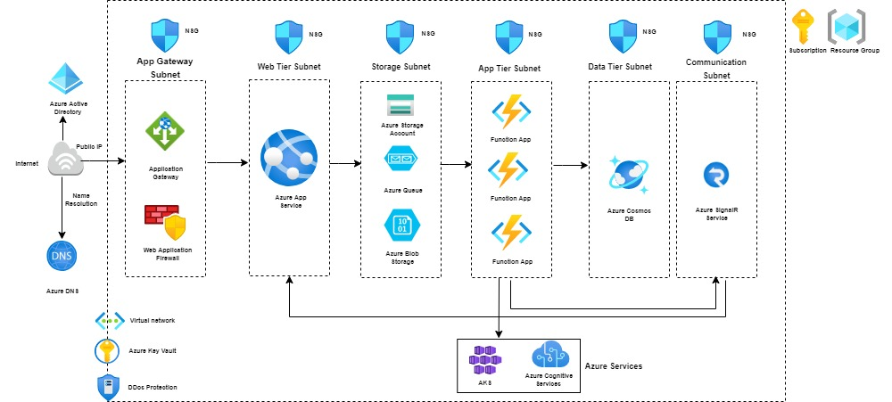

# 3-Tier Environment Architecture




# Terraform code to deploy three-tier architecture on azure

## Installation
- [Terraform](https://www.terraform.io/downloads.html)

### The Terraform resources will consists of following structure

```
├── main.tf                   // The primary entrypoint for terraform resources.
├── variables.tf              // It contain the declarations for variables.
├── output.tf                 // It contain the declarations for outputs.
├── terraform.tfvars          // The file to pass the terraform variables values.
```
### Module

A module is a container for multiple resources that are used together. Modules can be used to create lightweight abstractions, so that you can describe your infrastructure in terms of its architecture, rather than directly in terms of physical objects.

For the solution, we have created and used five modules:
1. resourcegroup        - creating resourcegroup
2. networking           - creating azure virtual network and required subnets
3. storage-account      - creating Azure Storage Account, Container and Queues
4. appservice-plan      - creating App Service plan to host web app and function app
5. web-app              - creating web app to host front-end app
6. backend-functionapps - creating function app to host backend-end app
7. cosmos-db            - creating cosmos db account, cosmos sql db and container

All the stacks are placed in the modules folder and the variable are stored under **terraform.tfvars**

To run the code you need to append the variables in the terraform.tfvars

## Deployment

### Steps

**Step 0** `terraform init`

used to initialize a working directory containing Terraform configuration files

**Step 1** `terraform plan`

used to create an execution plan

**Step 2** `terraform validate`

validates the configuration files in a directory, referring only to the configuration and not accessing any remote services such as remote state, provider APIs, etc

**Step 3** `terraform apply`

used to apply the changes required to reach the desired state of the configuration
